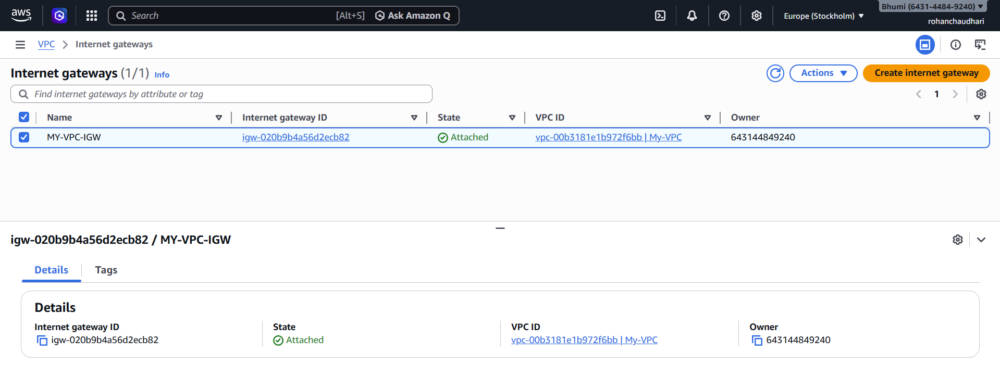
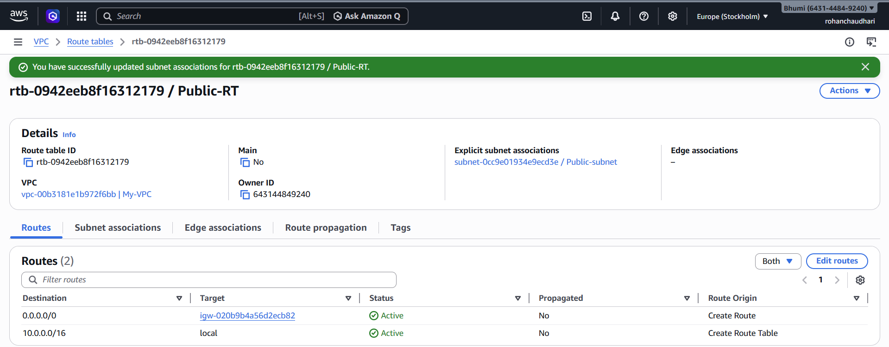
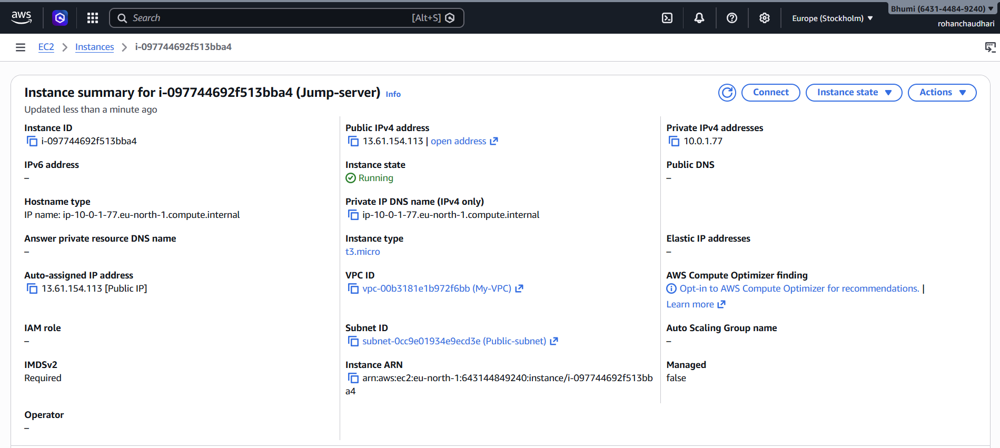
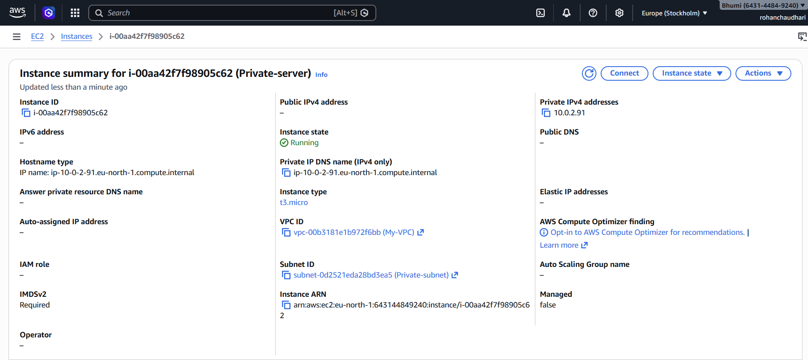
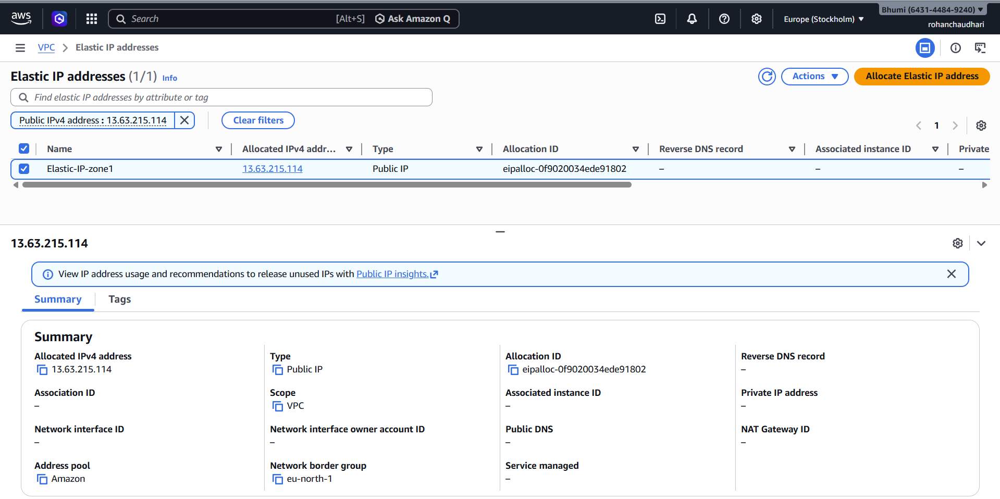
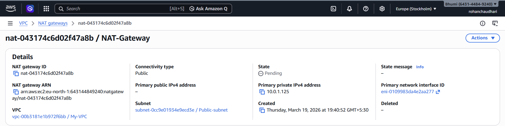
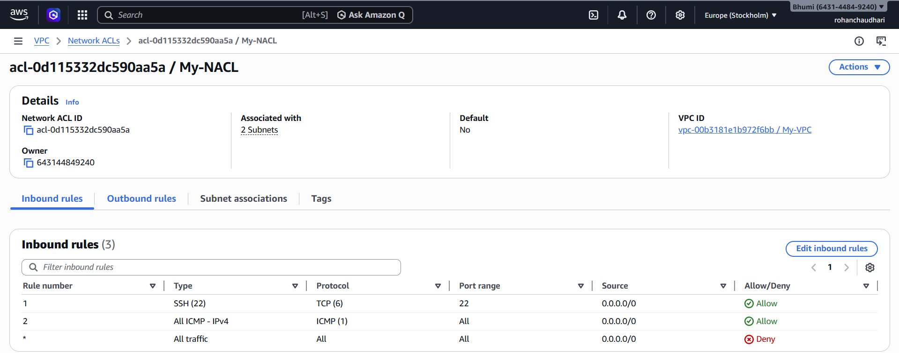
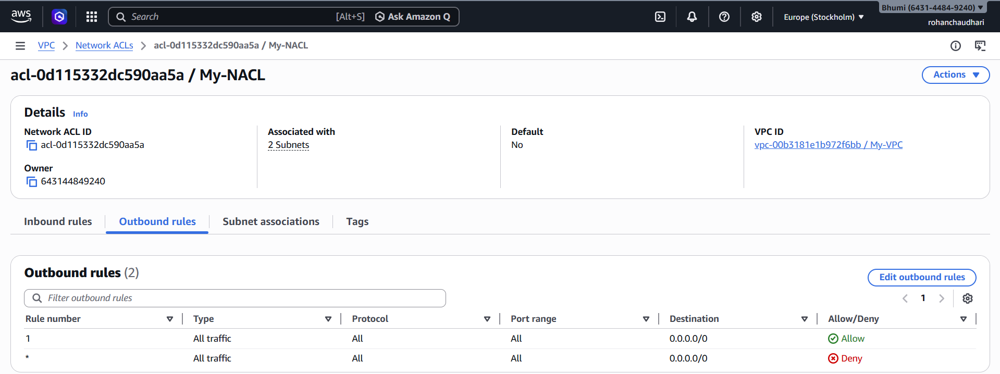
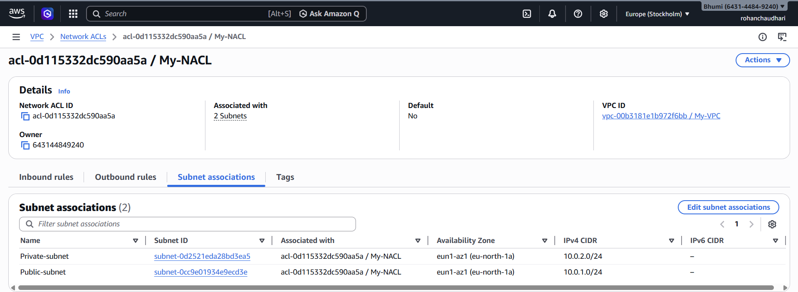

# aws-secure-vpc-bastion-nat

**Project :- Secure VPC Architecture with Bastion Host and NAT Gateway**

**Step 1 :**

Created a custom **Virtual Private Cloud (VPC)** with **CIDR block 10.0.0.0/16** to define an isolated network environment. 

This VPC acts as the foundation for **deploying** all cloud resources securely within a controlled IP range.

**Step 2 :**

Created two subnets within the VPC:

- **Public Subnet (10.0.1.0/24)** for internet-facing resources
- **Private Subnet (10.0.2.0/24)** for secure internal resources

This separation ensures proper **network isolation** between public and private components.

**Step 3 :**

Created an **Internet Gateway (IGW)** and **attached** it to the VPC to enable internet connectivity. 
This allows resources in the public subnet to **communicate** with the **internet**.

**Step 4 :**

Created a **route table** for the **public subnet** and added a route (0.0.0.0/0) pointing to the **Internet Gateway** to allow outbound internet traffic. 
**Associated** this route table with the public subnet to make it internet accessible.

**Step 5 :**

Launched an EC2 instance **(Bastion Host)** in the **public subnet** with an **assigned public IP** address. 
Configured a Security Group to allow SSH (port 22) access only from my **local IP**. This instance acts as a secure **jump server** to access private resources.

**Step 6 :**

Launched an EC2 instance in the **private subnet** **without assigning a public IP** to ensure it is not **directly accessible** from the **internet**. 
Configured its Security Group to **allow SSH** access only from the **Bastion Host’s Security Group**, ensuring controlled and secure access.

**Step 7 :**

Allocated an **Elastic IP** address and created a **NAT Gateway** in the **public subnet**. 

This enables instances in the **private subnet** to access the **internet** for **outbound traffic**.

such as updates and package installations while remaining **inaccessible from external sources**.

**Step 8 :**

Created a **route table** for the **private subnet** and added a **route (0.0.0.0/0)** pointing to the **NAT Gateway**. 
Associated this route table with the **private subnet** to allow secure outbound internet access without exposing the instances **publicly**.

**Step 9 :**

Configured **Security Groups** to enforce strict access control:

- **Bastion Host**: Allowed SSH (port 22) access only from my local IP
  
- **Private EC2**: Allowed SSH access only from the Bastion Host’s Security Group

Additionally, configured **Network ACLs (NACLs)** to allow necessary **inbound and outbound traffic** such as **SSH (port 22)** and **ICMP (ping)**, ensuring proper traffic flow while maintaining security.

**Inbound Configuartion : -**

**Onbound Configuartion : -**

**Subnet Association :-**

**Step 10 :**

Established a secure **SSH connection** by first connecting to the **Bastion Host** using its **public IP** and then accessing the **private EC2 instance** using its **private IP**. 
This ensures that private instances remain **inaccessible directly** from the internet.

