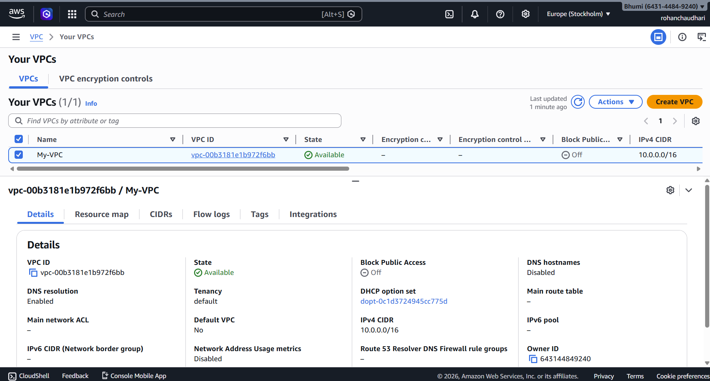
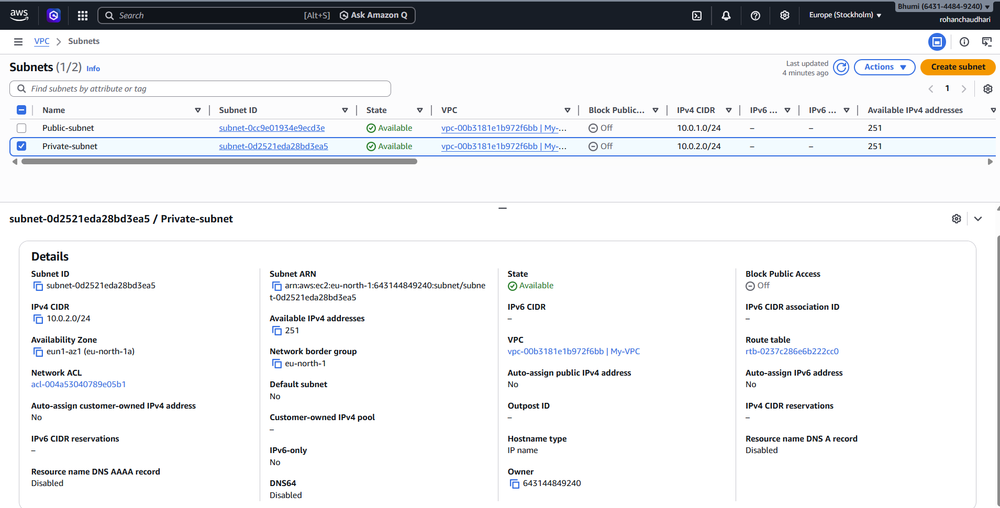

# aws-secure-vpc-bastion-nat

**Project :- Secure VPC Architecture with Bastion Host and NAT Gateway**

**Step 1 :**
Created a **custom VPC** with **CIDR 10.0.0.0/16** to define an isolated cloud network.

**Step 2 :**
Created **public** and **private** subnets to separate **internet-facing** and **internal resources** .

Public CIDR = 10.0.1.0/24 
Private CIDR = 10.0.2.0/24

**Step 3 :**

Attached an **Internet Gateway** to enable internet connectivity for the VPC.

